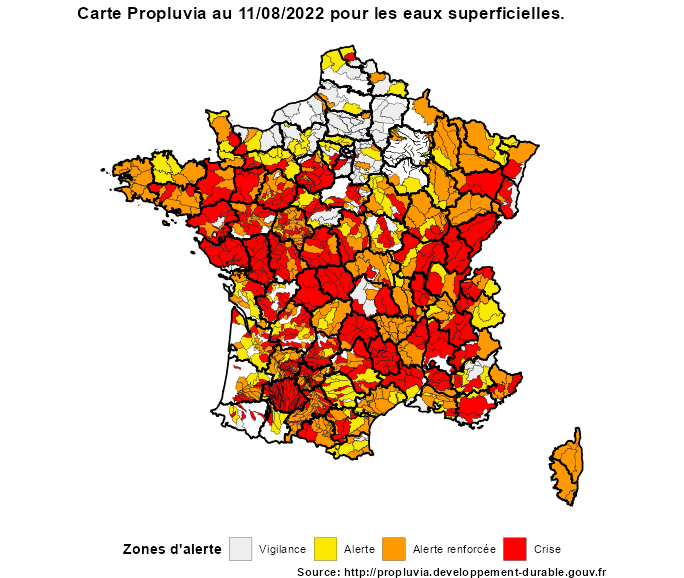

<!-- README.md is generated from README.Rmd. Please edit that file -->

# PropluviaR

<!-- badges: start -->

[](https://github.com/richaben/PropluviaR/actions/workflows/R-CMD-check.yaml)
[](http://www.gnu.org/licenses/gpl-3.0)
<!-- badges: end -->

Le package `PropluviaR` vise à faciliter la récupération des données
[Propluvia](https://propluvia.developpement-durable.gouv.fr/propluviapublic/accueil)
sur les restrictions d’eau à partir du site du gouvernement.

Il utilise l’API du site pour récupérer notamment les zones d’alerte
pour les eaux superficielles et souterraines à l’échelle de la France à
une date spécifiée.

L’export des données collectées est possible par la création d’une
couche `.gpkg` pour une utilisation SIG.

## ⚠️ Update 24 août 2022 ⚠️

L’accès à la nouvelle page
[Propluvia](https://propluvia.developpement-durable.gouv.fr/propluviapublic/accueil)
est actuellement suspendu ; Le package n’est donc plus fonctionnel pour
le moment…

## Installation ⚙️

Pour l’installer :

``` r
if (!require("devtools")) install.packages("devtools")
devtools::install_github("richaben/PropluviaR")
```

Pour le charger :

``` r
library(PropluviaR)
```

## Exemples

### Téléchargements des données 🖥️

-   Récupération des données du jour, sans export :

``` r
propluvia_data_jour <- 
  get_propluvia(export = FALSE)
```

-   Récupération des données à une date précise (ici le 23 juillet
    2022), sans export :

``` r
propluvia_data_20220723 <- 
  get_propluvia(date = '2022-07-23', export = FALSE)
```

-   Export au format geopackage `.gpkg` (à récupérer dans le dossier de
    travail) :

``` r
get_propluvia(export = TRUE)
```

### Un exemple de carte 🗺️

``` r
#devtools::install_github("MaelTheuliere/COGiter")
library(COGiter)

# shape pour les départements FR métropolitaine
dept_shp <- 
  COGiter::departements_geo %>% 
  dplyr::filter(!DEP %in% c("971", "972", "973", "974", "976"))

# les données Propluvia du jour !
propluvia_data_jour <- 
  get_propluvia(export = FALSE)

# palette de couleur
pal_colZone <- 
  setNames(unique(propluvia_data_jour$colSeuil),
           unique(propluvia_data_jour$nomNiveau))

# le graphique
plot_propluvia <-
  ggplot2::ggplot() +
  ggplot2::geom_sf(data = (propluvia_data_jour %>% 
                             dplyr::filter(typeZone == 'SUP')),
                   ggplot2::aes(fill=nomNiveau),
                   col='black',size=0.1) +
  ggplot2::scale_fill_manual(values = pal_colZone, "Zones d'alerte") +
  ggplot2::geom_sf(data = dept_shp, col='black', size=0.6, fill=NA) +
  ggplot2::labs(title = paste0("Carte Propluvia au ", format(Sys.time(),"%d/%m/%Y"), " pour les eaux superficielles."), 
                caption = "Source: http://propluvia.developpement-durable.gouv.fr") +
  ggplot2::theme_void() +
  ggplot2::theme(title = ggplot2::element_text(face = 'bold'),
                 legend.position = "bottom")

plot_propluvia
```


