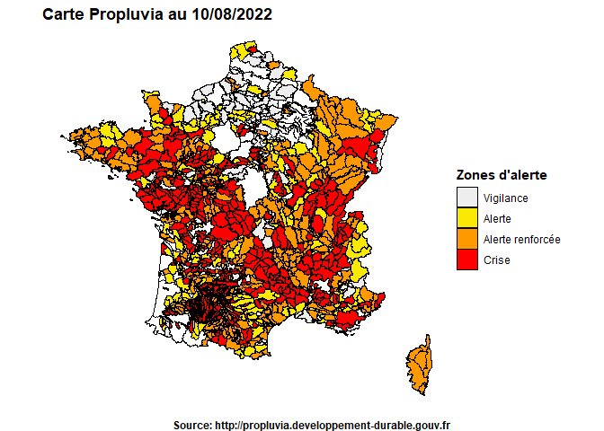

<!-- README.md is generated from README.Rmd. Please edit that file -->

# PropluviaR

<!-- badges: start -->

[](https://github.com/richaben/PropluviaR/actions/workflows/R-CMD-check.yaml)
<!-- badges: end -->

Le package `PropluviaR` vise à faciliter la récupération des données
[Propluvia](https://propluvia.developpement-durable.gouv.fr/propluviapublic/accueil)
sur les restrictions d’eau à partir du site du gouvernement.

Il utilise l’API du site pour récupérer notamment les zones d’alerte
pour les eaux superficielles et souterraines à l’échelle de la France à
une date spécifiée.

L’export des données collectées est possible par la création d’une
couche `.gpkg` pour une utilisation SIG.

## Installation

Pour l’installer :

``` r
if (!require("devtools")) install.packages("devtools")
devtools::install_github("richaben/PropluviaR")
```

## Exemple 🗺️

    #> 
    #> ── Récupération des données Propluvia ──────────────────────────────────────────
    #> ℹ Téléchargement <https://eau.api.agriculture.gouv.fr/apis/propluvia/zones/2022-08-10>
    #> ℹ Assemblage des données
    #> No encoding supplied: defaulting to UTF-8.


